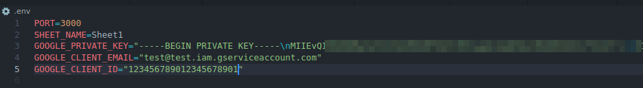

# NESTJS-GSHEET
NestJS application that creates a CRUD for the Google Sheets API

# Demo

> Host: http://nestjs-gsheet.onrender.com/healthcheck
>
> Swagger: **https://nestjs-gsheet.onrender.com/swagger**
>
> Deployed on: https://render.com

# Requirements
1. [Node 16](https://nodejs.org/en/download/)
2. [Postman](https://www.postman.com/downloads/)


# Setup
1. [Create a Google Cloud account](https://console.cloud.google.com)
2. Enable Google Sheets API
3. Get the necessary credentials from your google account: **private_key**, **client_email** and **client_id**
   1. Create an .env file
      ```sh
      cp .env.example .env
      ```
   2. Replace the three variables with the values collected above: **GOOGLE_PRIVATE_KEY**, **GOOGLE_CLIENT_EMAIL** and **GOOGLE_CLIENT_ID**

      
4. Get project dependencies:
   1. ```sh
        npm install -f
      ```
5. Download and import the postman file [docs/postman/nestjs-gsheet.postman_collection.json](https://raw.githubusercontent.com/stdioh321/nestjs-gsheet/main/docs/postman/nestjs-gsheet.postman_collection.json)


# RUN
```sh
npm run start:dev
```
> Open your browser at: http://localhost:3000/healthcheck
>
> Should receive the following result
> 
# How to Use
1. Create a [Google Spreedsheet](https://docs.google.com/spreadsheets)
   * Add some headers for it
   * Share it with anyone with the link and give permition for edit
   * Copy the **spreedsheet id** and **sheet name**

    | Create spreedshet                               | Sheet                               |
    | ----------------------------------------------- | ----------------------------------- |
    |  |  |

    | Share spreedsheet                             |
    | --------------------------------------------- |
    |  |

2. Open the swagger http://localhost:3000/swagger and execute the requests replacing the **spreedsheet id** and **sheet name**

    | Swagger                             |
    | ----------------------------------- |
    |  |

# REST API
The api of the application

### **Healthcheck**
Healthcheck for application

```http
GET /healthcheck
```
- Request

```json
{}
```
- Response

```json
"ok"
```
---
### **Get ROWS**
Get filtered list of ROWS

| Parameter   | Type     | Value                                                                                                                                                       | Description                  |
| ----------- | -------- | ----------------------------------------------------------------------------------------------------------------------------------------------------------- | ---------------------------- |
| `projectId` | `string` | 1-r2jRuEgjLwyllwVpDYeJyQjrtNDo6_kYo8FVXilN6c                                                                                                                | **Required** SpreedsheetId   |
| `sheet`     | `string` | Sheet1                                                                                                                                                      | Sheet name (Default: Sheet1) |
| `param*`    | `string` | `any text` Mario  <br /> `greater then` >10 <br /> `greater or equal` >=11  <br /> `lower than` <7 <br />  `lower or equal` <=10 <br /> `different then` !2 | Parameter ** for filter      |

```http
GET /google-sheets

/google-sheets?projectId={PROJECT_ID}&sheet={SHEET_NAME}&param1={PARAM1}&param2={PARAM2}
```
- Header

| Parameter | Type     | Value                   | Description                                |
| --------- | -------- | ----------------------- | ------------------------------------------ |
| `sort`    | `string` | FIELD_NAME,(asc / desc) | **Optional** The field and order to return |
```json
# Example
sort=phone,desc
```
- Request

```json
{}
```
- Response

```json
[
  {
    "phone": "7",
    "name": "andy",
    "price": "2.3",
    "email": "andy@example.com",
    "createdAt": "2023-03-02 22:11:22",
    "updatedAt": "2023-03-12 20:20:20",
    "__row_number": 12
  },
  {
    "phone": "6",
    "name": "lisa",
    "price": "2.2",
    "email": "lisa@example.com",
    "createdAt": "2023-03-03 6:45:12",
    "updatedAt": "2023-03-12 15:15:15",
    "__row_number": 11
  }
]
```
---
### **Post ROW**
Add one ROW

| Parameter   | Type     | Value                                        | Description                  |
| ----------- | -------- | -------------------------------------------- | ---------------------------- |
| `projectId` | `string` | 1-r2jRuEgjLwyllwVpDYeJyQjrtNDo6_kYo8FVXilN6c | **Required** SpreedsheetId   |
| `sheet`     | `string` | Sheet1                                       | Sheet name (Default: Sheet1) |

```http
POST /google-sheets
```
- Request

```json
{
  "phone": "7",
  "name": "mario",
  "price": "2.3",
  "email": "mario@example.com",
  "createdAt": "2023-03-02 22:11:22",
  "updatedAt": "2023-03-12 20:20:20"
}
```
- Response

```json
{
  "phone": "7",
  "name": "mario",
  "price": "2.3",
  "email": "mario@example.com",
  "createdAt": "2023-03-02 22:11:22",
  "updatedAt": "2023-03-12 20:20:20",
  "__row_number": 99
}
```
---
### **Put ROWS**
Update filtered ROWS

| Parameter   | Type     | Value                                                                                                                                                       | Description                  |
| ----------- | -------- | ----------------------------------------------------------------------------------------------------------------------------------------------------------- | ---------------------------- |
| `projectId` | `string` | 1-r2jRuEgjLwyllwVpDYeJyQjrtNDo6_kYo8FVXilN6c                                                                                                                | **Required** SpreedsheetId   |
| `sheet`     | `string` | Sheet1                                                                                                                                                      | Sheet name (Default: Sheet1) |
| `param*`    | `string` | `any text` Mario  <br /> `greater then` >10 <br /> `greater or equal` >=11  <br /> `lower than` <7 <br />  `lower or equal` <=10 <br /> `different then` !2 | Parameter ** for filter      |

```http
PUT /google-sheets

/google-sheets?projectId={PROJECT_ID}&sheet={SHEET_NAME}&param1={PARAM1}&param2={PARAM2}
```
- Request

```json
{
  "phone": "7",
  "name": "mario",
  "price": "2.3",
  "email": "mario@example.com",
  "createdAt": "2023-03-02 22:11:22",
  "updatedAt": "2023-03-12 20:20:20"
}
```
- Response

```json
[
  {
    "phone": "7",
    "name": "mario",
    "price": "2.3",
    "email": "mario@example.com",
    "createdAt": "2023-03-02 22:11:22",
    "updatedAt": "2023-03-12 20:20:20",
    "__row_number": 99
  },
  {
    "phone": "6",
    "name": "lisa",
    "price": "2.2",
    "email": "lisa@example.com",
    "createdAt": "2023-03-03 6:45:12",
    "updatedAt": "2023-03-12 15:15:15",
    "__row_number": 11
  }
]
```
---
### **Delete ROWS**
Delete filtered ROWS

| Parameter   | Type     | Value                                                                                                                                                       | Description                  |
| ----------- | -------- | ----------------------------------------------------------------------------------------------------------------------------------------------------------- | ---------------------------- |
| `projectId` | `string` | 1-r2jRuEgjLwyllwVpDYeJyQjrtNDo6_kYo8FVXilN6c                                                                                                                | **Required** SpreedsheetId   |
| `sheet`     | `string` | Sheet1                                                                                                                                                      | Sheet name (Default: Sheet1) |
| `param*`    | `string` | `any text` Mario  <br /> `greater then` >10 <br /> `greater or equal` >=11  <br /> `lower than` <7 <br />  `lower or equal` <=10 <br /> `different then` !2 | Parameter ** for filter      |

```http
DELETE /google-sheets

/google-sheets?projectId={PROJECT_ID}&sheet={SHEET_NAME}&param1={PARAM1}&param2={PARAM2}
```
- Request

```json
{}
```
- Response

```json
[
  {
    "phone": "7",
    "name": "mario",
    "price": "2.3",
    "email": "mario@example.com",
    "createdAt": "2023-03-02 22:11:22",
    "updatedAt": "2023-03-12 20:20:20",
    "__row_number": 99
  },
  {
    "phone": "6",
    "name": "lisa",
    "price": "2.2",
    "email": "lisa@example.com",
    "createdAt": "2023-03-03 6:45:12",
    "updatedAt": "2023-03-12 15:15:15",
    "__row_number": 11
  }
]
```


# References
* [Google Cloud account](https://console.cloud.google.com)
* [Render.com](https://render.com)

